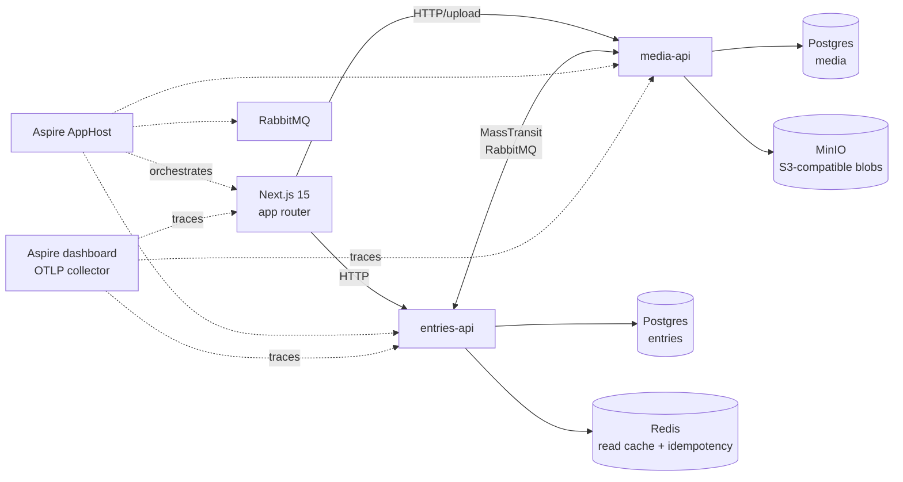

# triplog

A two-service travel journal demonstrating .NET Aspire orchestration, MassTransit saga-based coordination, and Clean Architecture across bounded contexts — built deliberately small so every distributed system decision can be explained line by line.

> **Status — v1 in progress.** Architecture, repo layout, and Aspire orchestration scaffolded. v2 will add auth and cloud deploy when I start using triplog as my actual travel journal.

## What this demonstrates

- **.NET Aspire** orchestration of two ASP.NET Core services + Postgres + RabbitMQ + Redis + MinIO from a single AppHost
- **Bounded contexts** — `Entries` and `Media` as separate services, each its own Clean Architecture stack (Domain → Application → Infrastructure → Api)
- **Domain-Driven Design** — aggregate roots, value objects, strongly-typed IDs, invariants enforced inside aggregates (same discipline as a single-service codebase, applied across a service boundary)
- **CQRS with MediatR** — write-side via aggregate repositories, read-side via projection-only DTOs
- **MassTransit saga** — `PublishEntrySaga` orchestrates the multi-service publish workflow with explicit compensation paths
- **`Result<T>` pattern** — domain failures returned as values, input-validation failures thrown and mapped centrally to RFC 7807 ProblemDetails
- **EF Core 10 + PostgreSQL** — each service owns its schema; strongly-typed ID + value-object conversions
- **OpenTelemetry** — distributed traces flow across HTTP → MediatR → MassTransit → RabbitMQ → EF Core → Postgres, viewed via the Aspire dashboard
- **Modern .NET 10 minimal APIs** — typed results, OpenAPI metadata, Scalar API browser
- **Next.js 15** frontend (TypeScript, Tailwind, shadcn/ui) talking to both services

## Architecture



## The publish-entry saga

A saga only earns its complexity when there's a real failure mode to compensate for. Here, media finalization (thumbnail generation, EXIF extraction, immutability marking) is asynchronous and can fail — so the publish workflow can't be a single transaction.

| Step | Service | Action | Compensation |
|---|---|---|---|
| 1 | entries-api | User uploads — `Entry` created in `Draft` with media placeholders | n/a |
| 2 | entries-api | User clicks **Publish** → `PublishEntrySaga` starts | n/a |
| 3 | media-api | `FinalizeMediaCommand` — thumbnails, EXIF, mark blobs immutable | Release placeholders |
| 4 | entries-api | On `MediaFinalized` → `Entry` → `Published` | Revert `Entry` → `Draft` |
| 5 | media-api | Failure → `MediaFinalizationFailed` → saga compensates | — |

## Why microservices for a travel journal?

This domain does not require microservices. Splitting it is the *point*.

A monolith would be the right answer for the actual product. But the project's goal is to demonstrate distributed-system patterns — Aspire orchestration, saga coordination, cross-service tracing, schema-per-service boundaries — in a domain simple enough that a reviewer can follow the saga at a single glance. Picking a domain that *required* microservices would obscure the patterns behind business complexity.

The split itself isn't arbitrary either: **entries** is small, relational, transactional metadata; **media** is large blob storage with async post-processing. That's the one seam where two services genuinely earn their keep, even at this scale.

## Design decisions

1. **Monorepo, single solution** — both services in one `.slnx` so the shared `Triplog.Contracts` project is referenceable without NuGet plumbing. Honest for portfolio scope; in production each service would publish contracts as a versioned package.
2. **Each service owns its database schema** — two named databases (`entries`, `media`) on one Aspire-managed Postgres server in local dev. Keeps the boundary truthful (no cross-schema joins) without spinning two Postgres containers.
3. **Saga lives in entries-api (orchestration, not choreography)** — `Entry` owns the publish state machine, so it's the natural orchestrator. Choreography would scatter state across services and obscure the failure-recovery story.
4. **No authentication** — explicitly out of scope. Requests carry a fake `X-User-Id` header. Auth would add infrastructure noise that distracts from the distributed-system patterns this project is meant to show.

## Getting started

Prerequisites: .NET 10 SDK, Docker Desktop, Node 20+, pnpm.

```bash
# trust the dev certificate (once)
dotnet dev-certs https --trust

# run everything via Aspire
dotnet run --project backend/Triplog.AppHost
```

The Aspire dashboard opens at `https://localhost:17235` and shows every service, container, log stream, and distributed trace.

For the frontend during development:

```bash
cd frontend/web
pnpm install
pnpm dev
```

## Project layout

```
triplog/
├── backend/
│   ├── Triplog.slnx
│   ├── Triplog.AppHost/                Aspire orchestrator
│   ├── Triplog.ServiceDefaults/        OTel, health checks, resilience, service discovery
│   ├── Triplog.Contracts/              Shared MassTransit messages
│   ├── Triplog.Entries.{Api,Application,Domain,Infrastructure}/
│   ├── Triplog.Media.{Api,Application,Domain,Infrastructure}/
│   └── Triplog.{Entries,Media}.Domain.UnitTests/
└── frontend/
    └── web/                            Next.js 15, Tailwind, shadcn/ui
```

## Explicitly out of scope for v1

- Real authentication or authorisation
- Cloud deployment (AWS / Azure / GCP)
- Production-grade observability (Grafana, alerting, SLOs)
- Mobile or offline support
- Production secrets management