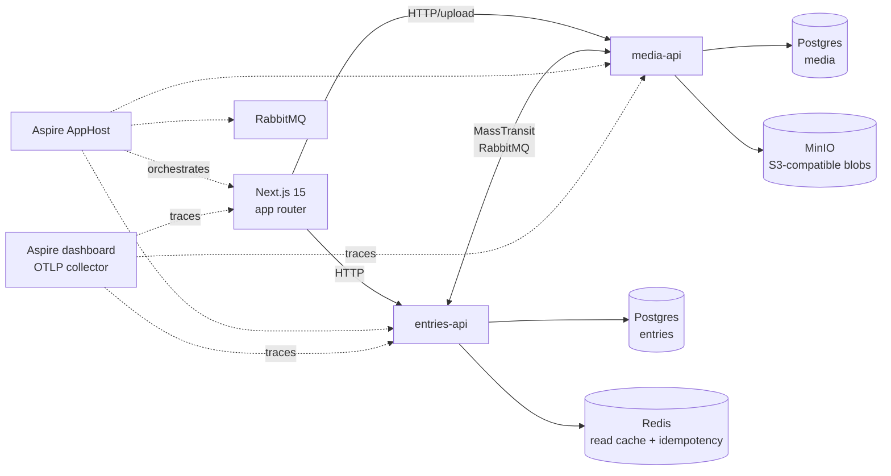
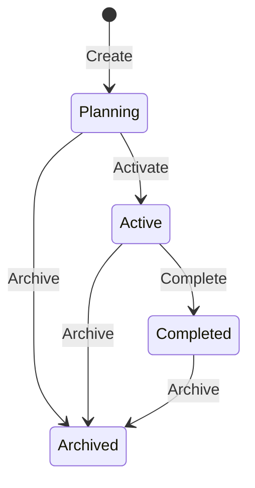
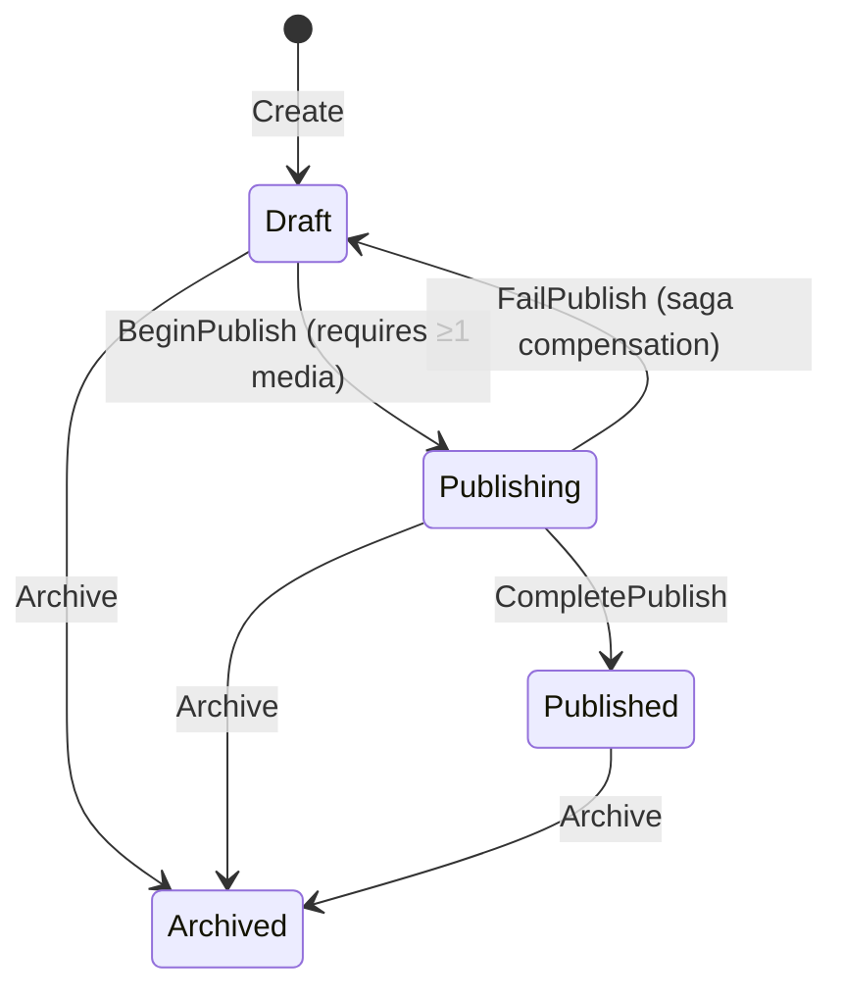
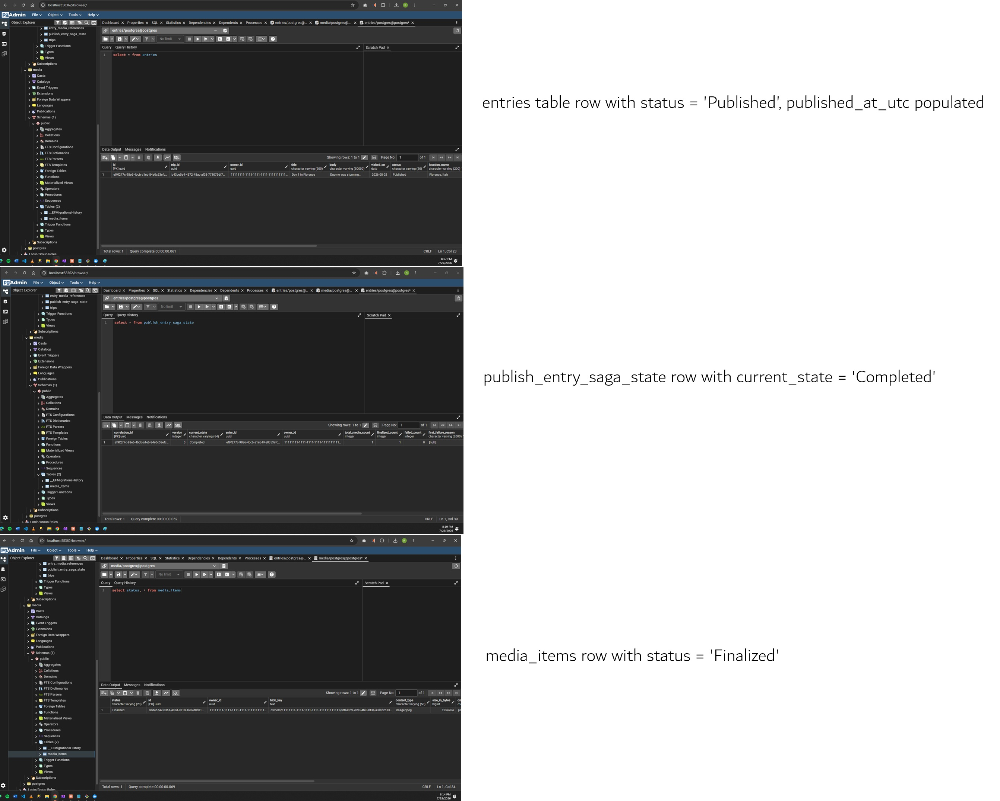
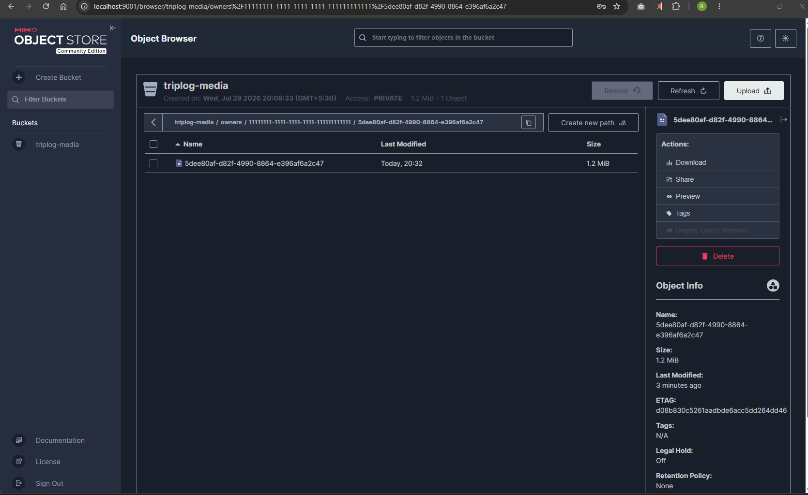
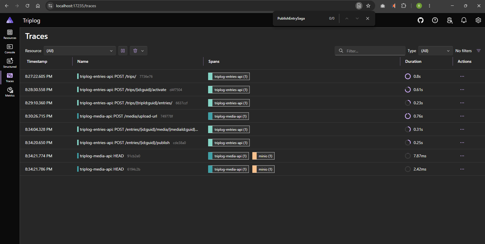

# triplog


A two-service travel journal demonstrating .NET Aspire orchestration, MassTransit saga-based coordination, and Clean Architecture across bounded contexts — built deliberately small so every distributed system decision can be explained line by line.

> **Status — v1 complete.** Full distributed saga runs end-to-end (entries-api → RabbitMQ → media-api → saga callback → entries-api). v2 will add real auth and cloud deploy.

## What this demonstrates

- **.NET Aspire** orchestration of two ASP.NET Core services + Postgres + RabbitMQ + Redis + MinIO from a single AppHost
- **Bounded contexts** — `Entries` and `Media` as separate services, each its own Clean Architecture stack (Domain → Application → Infrastructure → Api)
- **Domain-Driven Design** — aggregate roots, value objects, strongly-typed IDs, invariants enforced inside aggregates (same discipline as a single-service codebase, applied across a service boundary)
- **CQRS with MediatR** — write-side via aggregate repositories, read-side via projection-only DTOs
- **MassTransit saga** — `PublishEntrySaga` orchestrates the multi-service publish workflow with explicit compensation paths
- **`Result<T>` pattern** — domain failures returned as values, input-validation failures thrown and mapped centrally to RFC 7807 ProblemDetails
- **EF Core 10 + PostgreSQL** — each service owns its schema; strongly-typed ID + value-object conversions
- **OpenTelemetry** — distributed traces flow across HTTP → MediatR → MassTransit → RabbitMQ → EF Core → Postgres, viewed via the Aspire dashboard
- **Modern .NET 10 minimal APIs** — typed results, OpenAPI metadata, Scalar API browser
- **Next.js 15** frontend (TypeScript, Tailwind, shadcn/ui) talking to both services

Tech inventory:

| Layer | Choice | Why |
|---|---|---|
| .NET | 10 | Latest LTS-track at project start
| ASP.NET Core | minimal APIs | Less ceremony than controllers; matches modern templates
| Persistence | EF Core 10 + Postgres | Mature, queryable, ergonomic conversions
| Messaging | MassTransit + RabbitMQ | Saga state machines first-class; AMQP via Aspire
| Orchestration | .NET Aspire 13 | Single-file local infra graph + dashboard + tracing
| Observability | OpenTelemetry (via Aspire) | Standard, vendor-neutral, free dashboard
| Frontend | Next.js 16 + Tailwind 4 + shadcn 4 | React 19, app router, modern stack
| Testing (Domain) | xUnit + FluentAssertions 7.2.2 | FA 7 is the last Apache 2.0 release
| Blob storage | MinIO | S3-compatible, runs locally, zero cloud lock-in
| Cache | Redis | Read cache + idempotency keys

## Architecture



## Domain lifecycle

Each aggregate has an explicit state machine. These are the invariants enforced inside the aggregates — not just suggestions for the
application layer.

### Trip



> `UpdateDetails` is allowed from any non-archived state and does not transition.

### Entry



> `UpdateContent`, `AttachMedia`, and `RemoveMedia` are allowed only in `Draft` and do not transition.

## The publish-entry saga

A saga only earns its complexity when there's a real failure mode to compensate for. Here, media finalization (thumbnail generation, EXIF extraction, immutability marking) is asynchronous and can fail — so the publish workflow can't be a single transaction.

| Step | Service | Action | Compensation |
|---|---|---|---|
| 1 | entries-api | User uploads — `Entry` created in `Draft` with media placeholders | n/a |
| 2 | entries-api | User clicks **Publish** → `PublishEntrySaga` starts | n/a |
| 3 | media-api | `FinalizeMediaCommand` — thumbnails, EXIF, mark blobs immutable | Release placeholders |
| 4 | entries-api | On `MediaFinalized` → `Entry` → `Published` | Revert `Entry` → `Draft` |
| 5 | media-api | Failure → `MediaFinalizationFailed` → saga compensates | — |

## Why microservices for a travel journal?

This domain does not require microservices. Splitting it is the *point*.

A monolith would be the right answer for the actual product. But the project's goal is to demonstrate distributed-system patterns — Aspire orchestration, saga coordination, cross-service tracing, schema-per-service boundaries — in a domain simple enough that a reviewer can follow the saga at a single glance. Picking a domain that *required* microservices would obscure the patterns behind business complexity.

The split itself isn't arbitrary either: **entries** is small, relational, transactional metadata; **media** is large blob storage with async post-processing. That's the one seam where two services genuinely earn their keep, even at this scale.

## Design decisions

1. **Monorepo, single solution** — both services in one `.slnx` so the shared `Triplog.Contracts` project is referenceable without NuGet plumbing. Honest for portfolio scope; in production each service would publish contracts as a versioned package.
2. **Each service owns its database schema** — two named databases (`entries`, `media`) on one Aspire-managed Postgres server in local dev. Keeps the boundary truthful (no cross-schema joins) without spinning two Postgres containers.
3. **Saga lives in entries-api (orchestration, not choreography)** — `Entry` owns the publish state machine, so it's the natural orchestrator. Choreography would scatter state across services and obscure the failure-recovery story.
4. **No authentication** — explicitly out of scope. Requests carry a fake `X-User-Id` header. Auth would add infrastructure noise that distracts from the distributed-system patterns this project is meant to show.
5. **Time injection in the Domain layer** — all state-changing methods accept `DateTime nowUtc`, so tests are fully deterministic and there's no hidden `DateTime.UtcNow` call inside aggregates. See [ADR-007](backend/ADR-007-time-injection.md).
6. **`Result<T>` for expected failures** — the API layer maps error codes to HTTP status (`.NotFound` → 404, state conflicts → 409, everything else → 400). Validation failures use FluentValidation and are the one exception path — see [ADR-008](backend/ADR-008-result-pattern.md) and [ADR-009](backend/ADR-009-validation-throws-instead-of-result.md).

> See [docs/decisions](backend/README.md) for the full set of architecture decision records.

## Getting started

Prerequisites: .NET 10 SDK, Docker Desktop, Node 20+, pnpm.

```bash
# trust the dev certificate (once)
dotnet dev-certs https --trust

# run everything via Aspire
dotnet run --project backend/Triplog.AppHost
```

The Aspire dashboard opens at `https://localhost:17235` and shows every service, container, log stream, and distributed trace.

For the frontend during development:

```bash
cd frontend/web
pnpm install
pnpm dev
```

## API reference

entries-api exposes 17 endpoints — all wired through MediatR handlers with server-side FluentValidation, RFC 7807 ProblemDetails errors, and OpenAPI metadata. The full interactive reference lives at `/scalar/v1` on the entries-api URL (shown in the Aspire dashboard).

### Trips

| Verb | Route | Purpose |
|---|---|---|
| POST | `/trips` | Create a trip |
| GET | `/trips` | List trips for current owner |
| GET | `/trips/{id}` | Get a trip |
| PUT | `/trips/{id}` | Update details |
| POST | `/trips/{id}/activate` | Planning → Active |
| POST | `/trips/{id}/complete` | Active → Completed |
| POST | `/trips/{id}/archive` | Any → Archived |

### Entries

| Verb | Route | Purpose |
|---|---|---|
| POST | `/trips/{tripId}/entries` | Create an entry under a trip |
| GET | `/trips/{tripId}/entries` | List entries in a trip |
| GET | `/entries/{id}` | Get an entry |
| PUT | `/entries/{id}/content` | Update title, body, location, date |
| POST | `/entries/{id}/media/{mediaId}` | Attach media (idempotent within Draft) |
| DELETE | `/entries/{id}/media/{mediaId}` | Detach media |
| POST | `/entries/{id}/publish` | Draft → Publishing (kicks off saga in v1) |
| POST | `/entries/{id}/publish/complete` | Saga-called: Publishing → Published |
| POST | `/entries/{id}/publish/fail` | Saga-called: Publishing → Draft (compensation) |
| POST | `/entries/{id}/archive` | Any non-Archived → Archived |

### Media

| Verb | Route | Purpose |
|---|---|---|
| POST | `/media/upload-url` | Reserve a slot (creates Provisional MediaItem) + return presigned upload URL |
| GET | `/media/{id}` | Get media item metadata |
| GET | `/media/{id}/download-url` | Get presigned URL for viewing |
| POST | `/media/{id}/finalize` | Saga-called: Provisional → Finalized (verifies blob exists) |
| POST | `/media/{id}/fail` | Saga-called: Provisional → Failed (compensation) |

Every request requires the `X-User-Id: <guid>` header (v1 fake auth — see [ADR-006](backend/ADR-006-no-auth-v1.md)). Missing or invalid header → 401.

## Trying it out

Once Aspire is running (`dotnet run --project backend/Triplog.AppHost`):

1. From the Aspire dashboard, open the entries-api URL
2. Add `/scalar/v1` to browse the API interactively
3. Try `POST /trips` with header `X-User-Id: 11111111-1111-1111-1111-111111111111` and body:
   ```json
   { "title": "Italy 2026", "startDate": "2026-08-01", "endDate": "2026-08-14" }
   ```
4. Copy the returned id, then hit POST /trips/{id}/activate and POST /trips/{id}/entries
5. Inspect resulting rows in pgAdmin (/pgadmin from the dashboard) under the entries database





## Testing

Two layers of coverage — pure Domain tests and full-stack integration tests — both run in CI on every PR.

### Domain unit tests

Aggregates, value objects, and state-machine invariants have direct xUnit + FluentAssertions coverage under `Triplog.Entries.Domain.UnitTests` and `Triplog.Media.Domain.UnitTests`. Time is injected (see [ADR-007](backend/ADR-007-time-injection.md)) so every test is deterministic — no `DateTime.UtcNow` inside aggregates.

### Integration tests

`Triplog.IntegrationTests` boots both APIs in-process via `WebApplicationFactory<T>` against real containers spun up by [Testcontainers](https://testcontainers.com/) — Postgres 16, RabbitMQ 3, and MinIO. No mocks, no in-memory shims. What runs in the tests is what runs in production.

The suite covers three axes:

| Test class | What it proves |
|---|---|
| `TripCrudTests` | HTTP → MediatR → EF → Postgres round-trips work end-to-end; state transitions return correct status codes |
| `SagaHappyPathTests` | Distributed publish flow: create trip → create entry → upload bytes → attach media → publish → saga finalizes media → entry reaches `Published` |
| `SagaFailurePathTests` | Compensation path: publish without uploading the blob → media-api detects the missing object and fails → saga resets entry to `Draft` with `LastPublishFailReason` preserved (see [ADR-005](backend/ADR-005-saga-orchestration.md)) |

The saga tests are the marquee — a single test method drives HTTP requests through both services, real RabbitMQ, real Postgres, and real MinIO to prove the whole distributed system converges to the expected end state.

### CI

Every PR to `main` runs backend build + all tests via `.github/workflows/backend-ci.yml`. Testcontainers uses the GitHub-hosted Ubuntu runner's pre-installed Docker daemon — no extra setup, no shared state between runs.

## Project layout

```
triplog/
├── backend/
│   ├── Triplog.slnx
│   ├── Triplog.AppHost/                Aspire orchestrator
│   ├── Triplog.ServiceDefaults/        OTel, health checks, resilience, service discovery
│   ├── Triplog.Contracts/              Shared MassTransit messages (integration events)
│   ├── Triplog.Entries.Api/            Minimal-API endpoints, exception handling, header auth
│   ├── Triplog.Entries.Application/    CQRS commands + queries + validators + MediatR behaviors
│   ├── Triplog.Entries.Domain/         Aggregates, VOs, domain events, strongly-typed IDs
│   ├── Triplog.Entries.Infrastructure/ EF Core, Postgres, repositories, query projections
│   │   └── Persistence/                DbContext, configurations, interceptors, UoW
│   ├── Triplog.Media.Api/              Presigned upload URLs, saga-called finalize/fail
│   ├── Triplog.Media.Application/      CQRS commands + queries + validators
│   ├── Triplog.Media.Domain/           MediaItem aggregate, blob key VO, status state machine
│   ├── Triplog.Media.Infrastructure/   EF Core, Postgres, MinIO adapter, MassTransit consumers
│   │   └── Persistence/                DbContext, configurations, interceptors, UoW
│   └── tests/
│       ├── Triplog.Entries.Domain.UnitTests/
│       ├── Triplog.Media.Domain.UnitTests/
│       └── Triplog.IntegrationTests/   Testcontainers + WebApplicationFactory, saga end-to-end
├── frontend/
│   └── web/                            Next.js 15, Tailwind, shadcn/ui
└── docs/
    ├── decisions/                      ADR-001 through ADR-012
    └── screenshots/
```

## Explicitly out of scope for v1

- Real authentication or authorisation
- Cloud deployment (AWS / Azure / GCP)
- Production-grade observability (Grafana, alerting, SLOs)
- Mobile or offline support
- Production secrets management
